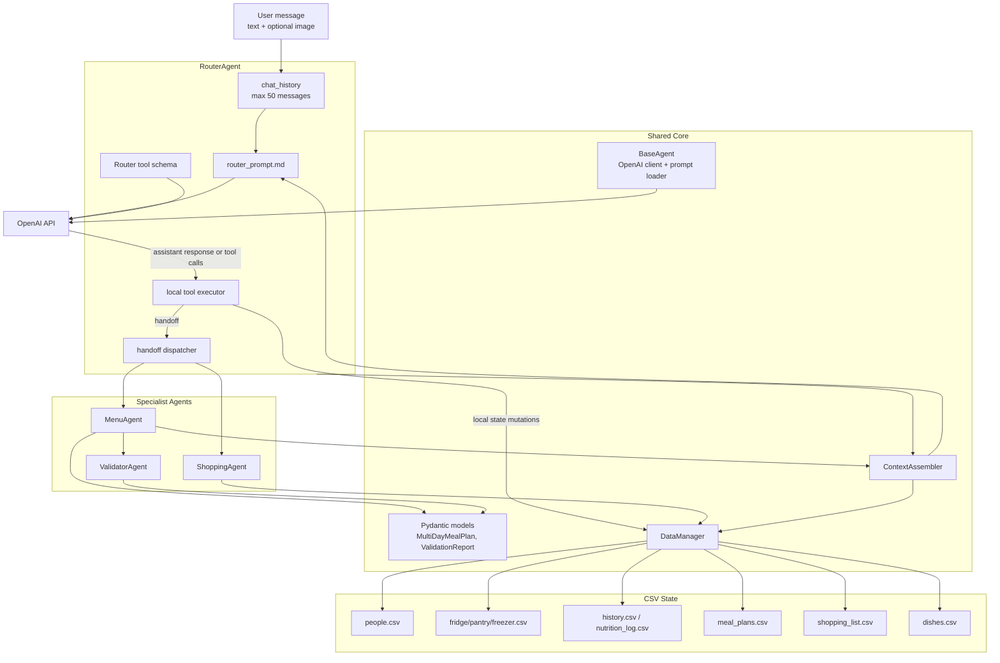

# C4 Component - Agent Core

## Purpose

Диаграмма раскрывает внутреннее устройство ядра системы: как RouterAgent, специализированные агенты, context, tools, модели и DataManager связаны между собой.

## Component Contracts

| Component | Input | Output | Side Effects |
|---|---|---|---|
| RouterAgent | user text, optional image | `{response, logs}` | chat history, CSV via local tools |
| MenuAgent | chat history | `{content, logs}` | meal_plans.csv, shopping_list.csv |
| ShoppingAgent | chat history | `{content, logs}` | inventory CSV, shopping_list.csv, shopping_habits.csv |
| ValidatorAgent | `DailyMealPlan`, context string | `ValidationReport` | None |
| ContextAssembler | current CSV state | context string | None |
| DataManager | filename + operation | records/status | CSV read/write |

