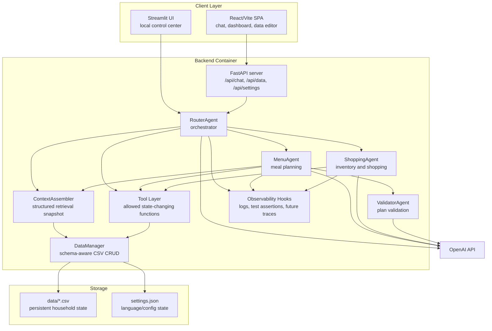

# C4 Container - FoodFlow PoC

## Purpose

Диаграмма показывает основные deployable/runtime containers и их взаимодействие: frontend, backend, agent core, retrieval/context, tool layer, storage и observability.

## Text Description

React/Vite и Streamlit - два UI-контейнера для PoC. React работает через FastAPI, Streamlit может обращаться к RouterAgent напрямую в одном Python process.

FastAPI отвечает за HTTP-контракты, загрузку изображений, settings, data endpoints и threadpool-вызов agent logic. Agent core состоит из RouterAgent, MenuAgent, ShoppingAgent и ValidatorAgent. ContextAssembler является retrieval-контейнером: он читает structured state и собирает prompt snapshot. Tool Layer ограничивает допустимые side effects, а DataManager выполняет реальные операции над CSV.

Observability в PoC минимальная: agents возвращают `logs`, тесты проверяют safety-свойства, а production tracing еще не реализован.

## Container Responsibilities

| Container | Responsibility |
|---|---|
| React/Vite SPA | User-facing chat, dashboard, table editing |
| Streamlit UI | Local all-in-one UI for debugging/demo |
| FastAPI | Public HTTP API for frontend |
| Agent core | Reasoning, routing, planning, validation |
| ContextAssembler | Deterministic retrieval/context snapshot |
| Tool Layer | Safe allowlist of state mutations |
| DataManager | Schema-aware persistence |
| CSV storage | Local durable state |
| Observability hooks | Logs now, metrics/traces later |

