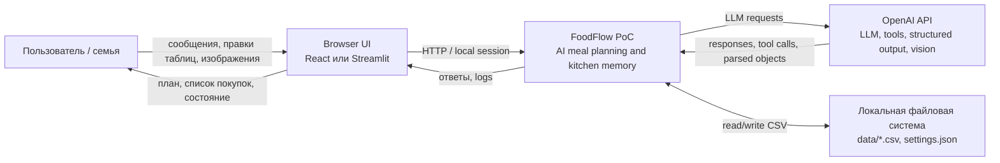

# C4 Context - FoodFlow PoC

## Purpose

Эта диаграмма показывает систему как черный ящик: кто с ней взаимодействует, какие внешние сервисы используются и где проходит граница PoC.

## Text Description

FoodFlow PoC работает как локальная система для одной семьи. Пользователь взаимодействует с ней через web-интерфейс: React frontend через FastAPI или Streamlit app. Внутри границы FoodFlow находятся backend, agent orchestration, retrieval/context assembly, tool layer и CSV-хранилище.

OpenAI API находится вне границы системы и используется только для reasoning, tool/function calling, structured output и анализа изображения. Локальные CSV-файлы считаются persistence boundary: это долговременная память PoC.

## Boundaries

Inside FoodFlow:

- HTTP API;
- agent orchestration;
- context assembly;
- tool handlers;
- CSV schemas and CRUD;
- local logs returned to UI.

Outside FoodFlow:

- OpenAI model execution;
- browser runtime;
- operating system and filesystem;
- any future delivery/nutrition/recipe APIs.

