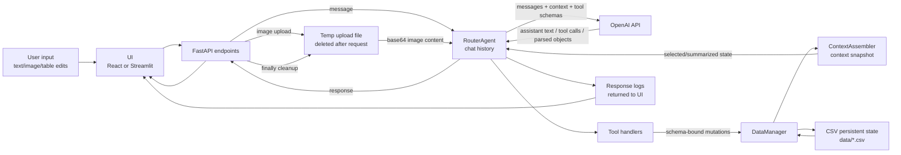

# Data Flow Diagram - FoodFlow PoC

## Purpose

Диаграмма показывает, как данные проходят через систему, что хранится, что отправляется в LLM, что логируется и какие данные являются ephemeral.

## Text Description

Persistent data находится в CSV: профили, ограничения, инвентарь, история, nutrition log, планы, список покупок, preferences. ContextAssembler читает CSV и превращает их в ограниченный prompt snapshot. В OpenAI API отправляется не весь filesystem, а только сообщения, prompt, selected context и tool schemas.

Tool calls возвращаются из LLM как structured arguments. Side effects выполняет Python-код через DataManager. Logs являются operational feedback для UI; в PoC они возвращаются в response, но не сохраняются в отдельном log store.

## Stored vs Ephemeral Data

| Data | Location | Lifetime |
|---|---|---|
| Chat history | RouterAgent memory | Until clear/restart/truncation |
| Uploaded image temp file | OS temp directory | Request lifetime |
| Context snapshot | Prompt message | Request lifetime |
| Tool call output | Chat turn/history | Session lifetime |
| Household data | `data/*.csv` | Persistent |
| Settings | `settings.json` | Persistent |
| Logs | API response | Ephemeral in PoC |

## Logging Policy

PoC logs should be short operational messages:

- handoff happened;
- context assembled;
- planning attempt count;
- validation pass/fail summary;
- tool execution summary.

Do not log full medical profiles, full images, API keys or raw hidden prompts.

