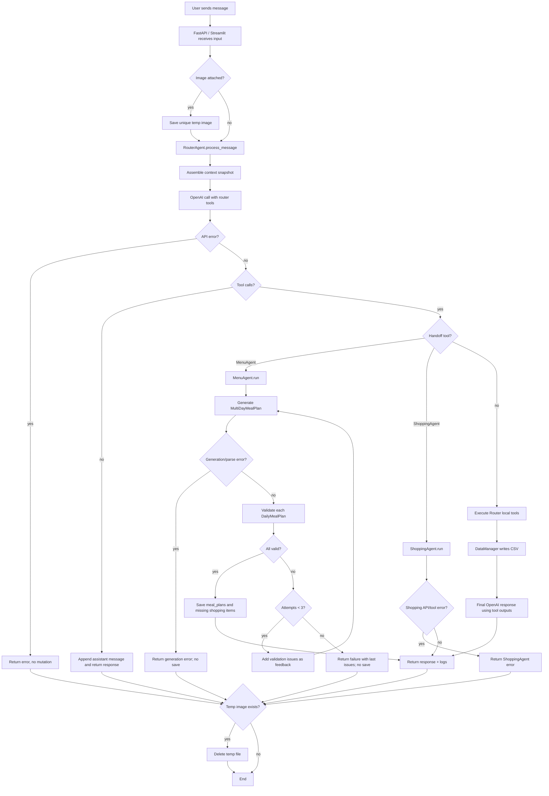

# Workflow / Graph Diagram - Request Execution

## Purpose

Диаграмма показывает пошаговое выполнение пользовательского запроса, включая основные ветки ошибок.

## Text Description

Основной путь: UI отправляет запрос, backend вызывает RouterAgent, RouterAgent собирает context snapshot и обращается к OpenAI. Модель либо отвечает напрямую, либо выбирает tool. Handoff tools переключают выполнение в MenuAgent или ShoppingAgent. Local tools выполняют ограниченные изменения состояния через DataManager.

Для meal planning есть отдельный критический цикл: generation -> validation -> retry. Если validation не проходит, issues возвращаются в prompt как feedback. После трех неудачных попыток план не сохраняется.

Ветки ошибок спроектированы так, чтобы по возможности не мутировать состояние: ошибка API до tool execution не меняет CSV; ошибка generation не сохраняет план; ошибка Validator приводит к invalid report и fail-closed отказу.

## Error Branches

| Branch | User-visible result | State mutation |
|---|---|---|
| Router OpenAI error | Error response | No mutation |
| Shopping OpenAI error | Error response | No mutation before tool execution |
| Plan parse/generation error | Error response | No plan saved |
| Validation failure after retries | Failure with issues | No plan saved |
| Validator API failure | Invalid report | No plan saved |
| Unknown tool | Tool output says unknown | No unsupported mutation |

